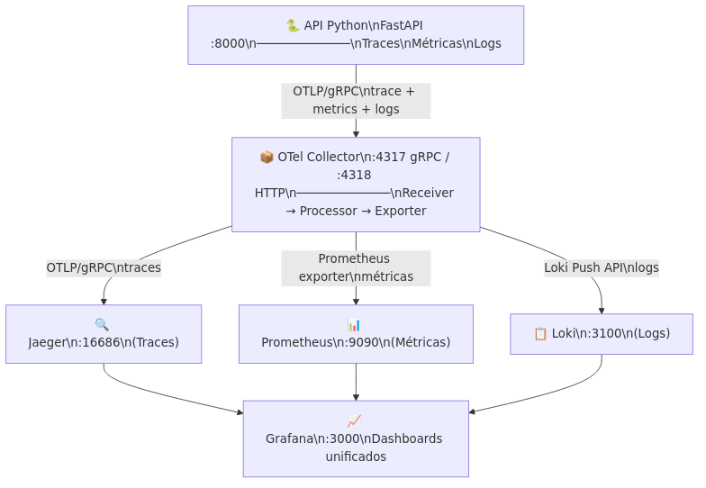

# Observabilidade com OpenTelemetry + Python

Exemplo completo de **traces, métricas e logs** instrumentados com OpenTelemetry,
coletados pelo **OTel Collector** e visualizados em **Grafana / Jaeger / Prometheus**.

---

## Arquitetura



```
┌─────────────────┐   OTLP/gRPC    ┌──────────────────────┐
│  API Python      │ ─────────────► │  OTel Collector       │
│  (FastAPI)       │                │  otel-collector:4317  │
└─────────────────┘                └──────────┬───────────┘
                                              │
                          ┌───────────────────┼───────────────────┐
                          ▼                   ▼                   ▼
                   ┌────────────┐    ┌──────────────┐    ┌──────────────┐
                   │   Jaeger   │    │  Prometheus  │    │    Loki      │
                   │  (traces)  │    │  (métricas)  │    │   (logs)     │
                   └─────┬──────┘    └──────┬───────┘    └──────┬───────┘
                         │                  │                   │
                         └──────────────────▼───────────────────┘
                                      ┌──────────┐
                                      │ Grafana  │
                                      │ :3000    │
                                      └──────────┘
```

---

## Pré-requisitos

| Ferramenta | Versão mínima |
|------------|--------------|
| Docker     | 24+          |
| Docker Compose | v2+      |

---

## Configuração (arquivo `.env`)

Crie um `.env` na raiz do projeto com suas credenciais (obrigatório para notificações):

```bash
# Webhook do Slack para alertas automáticos do Prometheus
SLACK_WEBHOOK_URL=https://hooks.slack.com/services/XXX/YYY/ZZZ

# Bot token e canal para script de notificação manual (opcional)
SLACK_BOT_TOKEN=xoxb-seu-token
SLACK_CHANNEL_ID=seu-channel-id
```

> **Como obter o webhook:** [Tutorial Slack Webhooks](https://api.slack.com/messaging/webhooks)

---

## Como executar

```bash
# 1. Clone / entre na pasta
cd observabilidade

# 2. Suba toda a stack
docker compose up --build

# 3. Aguarde todos os serviços ficarem saudáveis (~30 s)
docker compose ps
```

---

## Endpoints da API

| Método | URL | Descrição |
|--------|-----|-----------|
| GET | http://localhost:8000/ | Raiz |
| GET | http://localhost:8000/saude | Health-check |
| GET | http://localhost:8000/pedido/{id} | Processa pedido com trace + métrica + log |
| GET | http://localhost:8000/carga?quantidade=20 | Gera carga para popular dashboards |
| GET | http://localhost:8000/docs | Swagger UI interativo |

---

## Gerando dados de exemplo

```bash
# Processar alguns pedidos
./gerar_pedidos.sh

# Gerar carga maior de uma vez
curl "http://localhost:8000/carga?quantidade=50"
```

---

## UIs de visualização

| Serviço | URL | Usuário / Senha |
|---------|-----|----------------|
| Grafana | http://localhost:3000 | anônimo (sem login) |
| Jaeger  | http://localhost:16686 | — |
| Prometheus | http://localhost:9090 | — |
| Alertmanager | http://localhost:9093 | — |
| OTel zPages | http://localhost:55679/debug/tracez | — |
| OTel Health | http://localhost:13133 | — |

---

## Estrutura do projeto

```
observabilidade/
├── app/
│   ├── main.py                   # Aplicação FastAPI instrumentada
│   ├── requirements.txt          # Dependências Python
│   └── Dockerfile
├── alertmanager/
│   └── alertmanager.yml          # Config: roteamento de alertas para Slack
├── grafana/
│   └── provisioning/
│       ├── datasources/
│       │   └── datasources.yaml  # Prometheus + Jaeger + Loki
│       └── dashboards/
│           ├── dashboards.yaml   # Provisionamento automático
│           └── api-overview.json # Dashboard pré-configurado
├── otel-collector-config.yaml    # Pipeline do coletor
├── prometheus.yaml               # Scrape config (targets do OTel e interno)
├── prometheus-alerts.yml         # Regras de alerta (3 alertas de exemplo)
├── docker-compose.yaml           # Stack completa com 7 serviços
├── .env                          # Credenciais (SLACK_WEBHOOK_URL,SLACK_BOT_TOKEN, SLACK_CHANNEL_ID etc)
└── README.md                      # Este arquivo
```

---

## Sinais instrumentados

### Traces
- `processar-pedido` — span raiz com child spans:
  - `validar-pedido`
  - `persistir-pedido`
  - `notificar-cliente`
- `gerar-carga` com N operações filhas

### Métricas
| Nome | Tipo | Descrição |
|------|------|-----------|
| `api.requisicoes.total` | Counter | Total de requisições por endpoint |
| `api.latencia.ms` | Histogram | Latência em ms (p50, p95, p99) |
| `api.erros.total` | Counter | Erros por endpoint e tipo |

### Logs
Logs estruturados enviados via OTLP ao Collector e armazenados no Loki.

---

## Parando a stack

```bash
docker compose down -v   # -v remove os volumes (dados do Prometheus e Grafana)
```

---

## Notificação no Slack

Script pronto para envio de alerta:

```bash
./notificar_slack.sh "🚨 Falha detectada no endpoint /pedido"
```

Configuração necessária (Bot Token do Slack):

```bash
# no arquivo .env
SLACK_WEBHOOK_URL=XXXX
SLACK_BOT_TOKEN=xoxb-seu-token
SLACK_CHANNEL_ID=D015W3G8S1K

```

Exemplo completo:

```bash
set -a
source .env
set +a
./notificar_slack.sh "✅ Teste de alerta da stack de observabilidade"
```

### Alertmanager → Slack

Para enviar alertas automáticos do Prometheus para Slack via Alertmanager, configure o webhook no `.env`:

```bash
# no arquivo .env
SLACK_WEBHOOK_URL=https://hooks.slack.com/services/XXX/YYY/ZZZ
```

Após configurar, simplesmente suba o stack normalmente:

```bash
docker compose up -d
```

O docker-compose automaticamente:
1. Lê a variável `SLACK_WEBHOOK_URL` do `.env`
2. Renderiza o arquivo de config do Alertmanager com `awk`
3. Inicia o Alertmanager com o webhook configurado

Validar que funciona:
```bash
# Verificar se Alertmanager está saudável
docker compose ps alertmanager

# Ver logs de carregamento de config
docker logs alertmanager | grep "Completed loading"

# Testar acesso ao Alertmanager
curl -s http://localhost:9093/-/ready
```

Arquivos usados:
- `alertmanager/alertmanager.yml` – template com placeholder `${SLACK_WEBHOOK_URL}`
- `prometheus-alerts.yml` – regras de alerta
- `prometheus.yaml` – configuração que aponta para o Alertmanager

Alertas configurados:
- `ApiErrosDetectados` – dispara quando taxa de erros > 0
- `ApiLatenciaP95Alta` – dispara quando latência p95 > 500ms
- `SemRequisicoesNaApi` – alerta informativo quando API inativa
